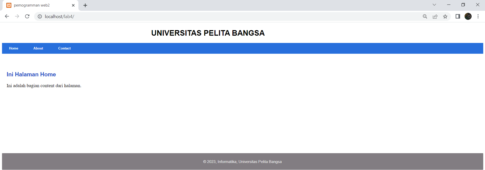
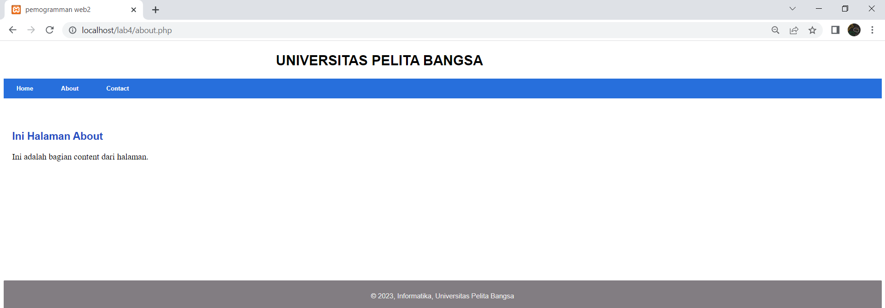
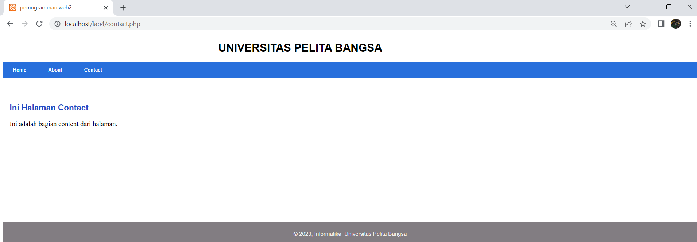
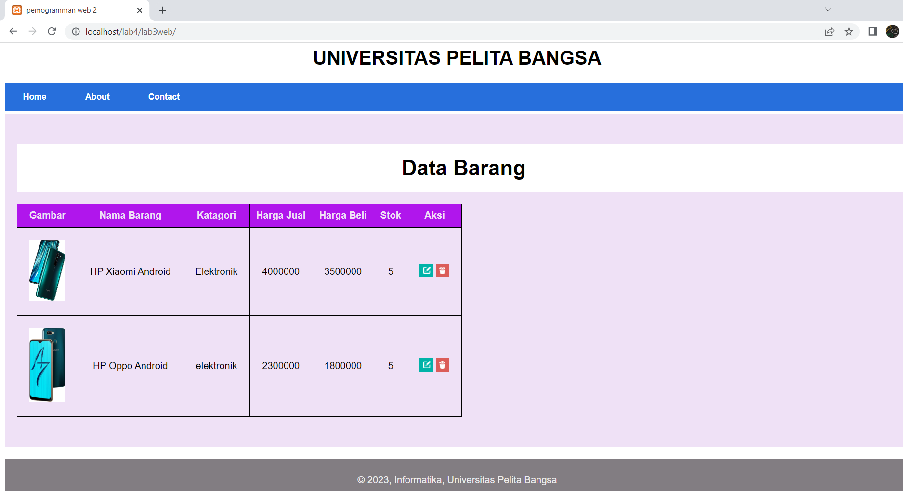

## **halaman home**


### _Code :_
```
<?php require('header.php'); ?>
<div class="content">
  <h2>Ini Halaman Home</h2>
  <p>Ini adalah bagian content dari halaman.</p>
</div>
<?php require('footer.php'); ?>
```

### _Output :_



</br></br>

## **halaman about**


### _Code :_
```
<?php require('header.php'); ?>
<div class="content">
  <h2>Ini Halaman About</h2>
  <p>Ini adalah bagian content dari halaman.</p>
</div>
<?php require('footer.php'); ?>
```

### _Output :_



</br></br>

## **halaman contact**


### _Code :_
```
<?php require('header.php'); ?>
<div class="content">
  <h2>Ini Halaman Contact</h2>
  <p>Ini adalah bagian content dari halaman.</p>
</div>
<?php require('footer.php'); ?>
```

### _Output :_



</br></br>

## **menghubungkan praktikum lab3 dan lab4**

### _Output :_



</br></br>
